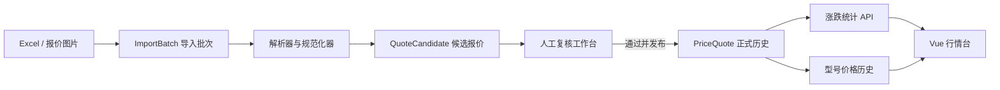

# PriceRadar · 3C 回收行情助手

第一版已经跑通「Excel / 图片导入 → 清洗与结构化 → 人工复核 → 发布入库 → 同型号历史与涨跌统计」闭环。当前生产库保留了用户上传的思物通讯报价表作为待复核批次，确认后才会写入正式价格历史。

## 当前状态

- 生产数据库：MySQL `price_radar`
- 本机 Python 环境：`D:\anaconda3\envs\price-radar`
- 已导入草稿：批次 `#1`，2093 条候选，状态 `review`
- Excel：直接解析工作簿，按工作表识别报价日期、品类和品牌
- 图片：支持 OpenAI Vision 识别；没有 API Key 时保留图片，并允许粘贴人工识别文本重解析
- 无报价：`no_quote`；星号遮挡：`masked`；两类记录都会保留，但不参与涨跌统计
- 涨跌口径：当前明确报价与此前最近一条明确报价比较

## 架构



代码按层拆分，后续增加新的报价来源、品牌规则、通知、定时任务或其他 3C 品类时，不需要改写整套系统：

- `frontend/`：Vue 3、TypeScript、Vite、Pinia、Element Plus、ECharts
- `backend/app/api/`：FastAPI 路由，只处理 HTTP 输入输出
- `backend/app/services/`：Excel、OCR、解析、发布、涨跌计算等业务逻辑
- `backend/app/models/`：SQLAlchemy 数据模型
- `backend/alembic/`：MySQL 结构迁移
- `backend/tests/` 与 `backend/scripts/e2e_smoke.py`：解析和全链路回归

更详细的字段与扩展边界见 [架构说明](docs/ARCHITECTURE.md)。

## 本机启动

MySQL 服务启动且 `backend/.env` 已配置后，在项目根目录运行：

```powershell
powershell -ExecutionPolicy Bypass -File .\scripts\run-dev.ps1
```

Windows 下也可以直接双击项目根目录的 `start.bat`。

启动地址：

- 前端：http://127.0.0.1:5173
- 后端接口文档：http://127.0.0.1:8000/docs
- 健康检查：http://127.0.0.1:8000/health

脚本会返回两个进程 ID，可用输出中的 `Stop-Process` 命令停止。

## 从零配置

```powershell
conda create --prefix D:\anaconda3\envs\price-radar python=3.12 -y
conda activate D:\anaconda3\envs\price-radar
pip install -r .\backend\requirements.txt

Copy-Item .\backend\.env.example .\backend\.env
# 编辑 backend/.env，填写 DATABASE_URL；如需自动图片识别，再填写 OPENAI_API_KEY

Set-Location .\backend
alembic upgrade head

Set-Location ..\frontend
npm install
npm run build
```

首次使用 MySQL 时先创建数据库：

```sql
CREATE DATABASE price_radar CHARACTER SET utf8mb4 COLLATE utf8mb4_0900_ai_ci;
```

真实密码仅放在被 Git 忽略的 `backend/.env` 中；`.env.example` 和 Alembic 配置不保存密码。

## 使用流程

1. 在「数据导入」选择 Excel 或图片并上传。
2. Excel 会直接生成候选；图片有 API Key 时自动识别，没有时可粘贴人工识别文本。
3. 在「复核工作台」查看原文、来源单元格、置信度、型号、规格、颜色、价格状态和价格。
4. 逐条修正或批量通过/拒绝。
5. 点击「发布报价」后写入正式历史。
6. 第二期同型号报价发布后，在市场概览和报价历史中查看涨跌额、涨跌幅与趋势。

系统不会把“没有价格”强行补成 0，也不会在上传后自动发布，避免错误数据污染价格历史。

## 主要接口

- `POST /api/v1/imports`：上传 Excel 或图片
- `GET /api/v1/imports/{id}/candidates`：分页查看识别候选
- `PATCH /api/v1/imports/candidates/{candidate_id}`：人工修正
- `POST /api/v1/imports/{id}/review-all`：批量复核
- `POST /api/v1/imports/{id}/reparse-image`：用人工文本重解析图片
- `POST /api/v1/imports/{id}/reparse-excel`：安全重解析尚未人工处理的 Excel 草稿
- `POST /api/v1/imports/{id}/commit`：发布正式报价
- `GET /api/v1/quotes/changes`：涨跌列表
- `GET /api/v1/quotes/{model_key}/history`：型号历史
- `GET /api/v1/dashboard/summary`：行情概览

## 验证

```powershell
$env:PYTHONNOUSERSITE='1'
Set-Location .\backend
& 'D:\anaconda3\envs\price-radar\python.exe' -s .\scripts\e2e_smoke.py 'D:\path\to\报价表.xlsx'

Set-Location ..\frontend
npm run build
```

E2E 使用独立数据库 `price_radar_test_e2e`，会验证真实 Excel 导入、图片文本回退、无报价/遮挡价格、发布、历史和涨跌幅，不会清空生产数据库。

## 下一阶段建议

第一版不需要 LangChain 或向量数据库；这里的核心是稳定的数据管道和审核状态机。等数据量和来源增加后，再按需要加入：

- Redis + RQ/Celery：异步 OCR、批量导入和任务重试
- S3/MinIO：原始报价图片与表格归档
- APScheduler/Celery Beat：定时抓取或提醒上传
- 规则版本、别名字典和回归样本库：持续提高型号归一化
- 用户、角色和审核日志：多人协作
- Docker Compose：部署到服务器时统一 MySQL、API、Web 与 Redis
