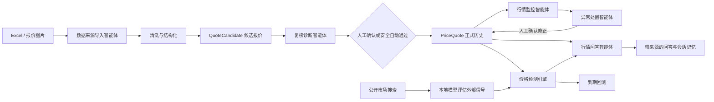

# PriceRadar · 3C 数码回收行情智能体

PriceRadar 是一个面向 3C 数码回收报价的本地智能处理系统，覆盖「Excel / 图片导入 → 结构化清洗 → 智能与人工复核 → 发布入库 → 行情监控 → 异常处置 → 行情问答与价格预测」完整闭环。

系统默认使用本地 Ollama 与 `qwen2.5:7b`，不依赖付费大模型 API。价格计算、异常检测和数据修改由确定性程序完成，大模型负责理解问题、调用工具、归纳证据和生成建议，避免直接猜测报价。

## 已实现功能

### 1. 数据来源导入智能体

- 支持 Excel、PNG、JPG、JPEG、WEBP，单次最多选择 30 个文件。
- Excel 优先直接读取工作簿单元格，不经过 OCR，适合作为主要数据来源。
- Excel 入库前预检：区分可直接复核、重点检查、重复报价、异常波动和信息不完整。
- 图片使用 OpenCV 表格定位与 RapidOCR 本地识别，不需要 API Key。
- 每张图片独立处理，自动读取标题、报价日期和所属板块。
- 后台任务逐文件处理，前端显示真实进度、当前文件、成功与失败状态，并支持失败重试。
- 导入完成后由本地模型生成本次数据质量总结和处理建议。
- 支持人工粘贴识别文本作为图片 OCR 的回退方式。

### 2. 数据清洗与结构化

- 拆分品牌、型号、容量、颜色、版本、价格状态和价格。
- 统一 OnePlus / 一加等常见品牌表达，规范型号和容量格式。
- 一行包含多个颜色价格时拆成多条候选记录，同时保留来源行关系。
- `no_quote` 表示暂无报价；`masked` 表示价格含通配数字，两类都保留但不参与精确涨跌计算。
- `*`、`x` 等通配符按“一符一位未知数字”处理，例如 `13**` 表示 `1300–1399` 范围，不会被保存成 13 元。
- 保留 Excel 单元格地址或图片坐标，用于后续来源核对。

### 3. 复核诊断智能体

- 单条智能诊断：综合识别置信度、字段完整性、重复情况、历史报价和来源原文判断风险。
- 展示诊断步骤、证据、风险等级、原因和修改建议。
- 建议必须经人工确认后才能写入，不会由模型直接修改数据。
- 支持整行 / 整个单元格编辑，可增加或删除同一型号下的颜色价格。
- 支持单条通过、拒绝、编辑、删除以及查看来源。
- Excel 显示原始单元格；图片显示原图并定位识别区域。
- 支持修改批次报价日期、重新打开已发布批次进行检查。

### 4. 一键自动审核与质量控制

- 一键扫描整个批次，只自动通过高置信、结构完整且未发现明显风险的记录。
- 风险记录继续保留给人工复核，并给出处理建议。
- 已自动通过的记录可以单独撤销，退回待复核状态。
- 自动审批抽查：从自动通过记录中随机抽取样本进行人工质量检查。
- 抽查发现错误时自动撤销该记录的自动通过状态。
- 统计自动通过数量、抽查覆盖率、抽查正确率、待抽查数量和累计撤销数量。

### 5. 审核操作日志

- 记录人工通过、拒绝、编辑、智能体建议采用、自动审批、撤销、抽查和行情异常修正。
- 保存修改前数据、修改后数据、变更字段、操作来源、智能体运行编号和模型名称。
- 支持查看单条记录日志，也支持按批次和操作类型筛选。

### 6. 行情发布与历史

- 只有完成复核的候选数据才能发布为正式报价。
- 同一候选不会重复发布。
- 报价历史支持分页、品牌筛选和型号搜索。
- 涨跌口径为当前明确报价与此前最近一条相同规格明确报价比较。
- 市场概览展示总体行情、品牌分类、涨跌数量和重点波动。
- 支持删除未发布批次；危险的全量清空功能需要输入确认文字。

### 7. 行情智能问答

- 使用 Ollama `qwen2.5:7b` 理解自然语言问题，自主选择数据库查询、价格预测或公开市场搜索工具。
- 支持查询最新价格、历史价格、涨跌排行、品牌行情和异常波动。
- 支持询问未来 1、3、7、10 天报价方向、价格区间、概率、置信度与样本量。
- 支持调查官方、电商、二手平台和资讯网页，联网来源可从回答中直接打开。
- 回答附带数据来源；内部价格只基于已发布报价，外部网页明确标记为辅助参考。
- 对话和消息持久化到 MySQL，刷新页面或重启项目后仍然保留。
- 每个对话拥有独立记忆，可保存品牌、型号、容量、颜色和上次问题。
- 支持上下文追问，例如先问“红米 K80 最新价”，再问“它和上一期比怎么样”。

### 8. 行情监控智能体

- 可手动运行，也会在新报价发布后自动运行。
- 自动比较最新报价日与上一报价日。
- 检测价格异常、报价数量骤减、型号新增、型号消失、容量倒挂和颜色价差。
- 按高风险、需关注和信息分级，支持按处置状态、风险和类型筛选。
- 本地模型根据检测证据生成行情简报，不改变程序计算出的数字。
- 保存每次运行记录；修正异常后自动执行一次复检。

### 9. 异常处置智能体

- 从监控异常回查当前报价、上一期价格、来源原文、原始位置和候选记录。
- 状态包括待诊断、待确认、已修正和已忽略。
- 普通大幅波动只给核对建议，不强行推测正确价格。
- 对有充分证据的明显漏位问题可提出建议价格，但必须人工确认。
- 对 `46xx`、`13**` 等通配价格建议恢复为“价格区间 / 掩码”，不会用上一期价格冒充精确值。
- 人工采用建议后同步更新正式报价与原候选记录、写入审核日志并启动行情复检。
- 对确认属于真实行情的波动，可以标记为无需处理。

### 10. 多周期价格预测

- 新增独立“价格预测”工作台，预测对象优先精确到型号＋容量＋颜色，版本等字段作为辅助规格。
- 同时给出未来 1、3、7、10 天预测，中位价、上下区间、涨/平/跌概率与置信度；默认突出未来 3 天。
- 内部价格由最近历史报价的稳健加权趋势和波动率计算，并限制异常单日变化对结果的影响。
- 可选采集公开市场信息，并由本地 Qwen 模型评估其方向影响；外部修正受限，不能覆盖内部历史事实。
- 保存每次预测。目标日期产生真实报价后，自动计算方向准确率、区间命中率和平均绝对误差。
- 预测最长不超过 10 天；样本不足两个不同报价日时拒绝给出数字预测。

### 11. 金山文档每日监测与自动入库

- 使用本机 Playwright + Windows 任务计划程序每日检查指定金山文档，不依赖 Codex 保持运行。
- 每次下载后按 SHA-256 判断内容是否更新；相同内容不会重复保存或创建批次。
- 新版本保存至 `backend/storage/uploads/kdocs-daily/`，不覆盖历史文件。
- 下载后自动创建 Excel 导入批次并完成入库前检查，自动识别工作簿中的报价日期。
- 相同内容不会重复创建批次；任务严格停在复核工作台，不会自动审批或发布。
- 如果登录失效、页面结构变化或下载失败，任务会返回失败状态并把原因写入本地日志；重新双击设置脚本即可刷新登录。

首次设置时双击根目录 `setup-kdocs-auto-sync.bat`，在 Edge 中完成一次金山文档登录，然后回到命令窗口按回车。脚本会立即测试一次同步，并安装每天 12:00 执行的本机任务；错过执行时间时会在电脑下次可用时补跑。

- 立即手动同步：双击 `sync-kdocs-now.bat`
- 取消自动同步：双击 `remove-kdocs-auto-sync.bat`
- 运行日志：`backend/storage/logs/kdocs-sync-年月.log`
- 登录信息只保存在被 Git 忽略的 `backend/storage/kdocs-auth-state.json`，不要复制或提交该文件。

## 智能体工作流



这里的智能体不是单纯聊天界面：模型需要读取上下文、选择业务工具、获得数据库证据、形成判断，并在人工授权范围内触发下一步工作流。所有高风险写操作仍由程序校验和人工确认控制。

## 技术栈与代码结构

- 前端：Vue 3、TypeScript、Vite、Pinia、Element Plus、ECharts
- 后端：Python 3.12、FastAPI、Pydantic、SQLAlchemy、Alembic
- 数据库：MySQL 8、PyMySQL
- Excel：openpyxl
- 图片识别：OpenCV、RapidOCR、ONNX Runtime
- 本地大模型：Ollama、Qwen2.5 7B
- 测试：pytest、Playwright CLI

主要目录：

- `frontend/src/views/`：智能问答、价格预测、监控、概览、导入、复核和历史页面
- `backend/app/api/routes/`：FastAPI 接口层
- `backend/app/services/`：导入、解析、审核、行情、智能体和异常处置逻辑
- `backend/app/models/`：SQLAlchemy 数据模型
- `backend/alembic/`：MySQL 数据库迁移
- `backend/tests/`：解析、后台任务、智能体、审核质量和行情监控测试
- `scripts/`：Windows 本地启动脚本

详细设计见 [架构说明](docs/ARCHITECTURE.md)。

项目展示可直接参考 [10 分钟演示稿](docs/DEMO_SCRIPT.md)。

## 本机要求

- Windows 10 / 11
- MySQL 8
- Python 3.12（项目默认环境为 `D:\anaconda3\envs\price-radar`）
- Node.js 与 npm
- Ollama 与本地模型 `qwen2.5:7b`

确认模型：

```powershell
ollama list
ollama pull qwen2.5:7b
```

OCR 和 Excel 解析不依赖 Ollama；Ollama 不可用时，导入、复核、发布和确定性监控仍可运行，但模型总结与自然语言问答会受限。

## 从零配置

后端：

```powershell
conda create --prefix D:\anaconda3\envs\price-radar python=3.12 -y
conda activate D:\anaconda3\envs\price-radar
pip install -r .\backend\requirements.txt

Copy-Item .\backend\.env.example .\backend\.env
# 编辑 backend/.env，设置 DATABASE_URL
```

首次创建数据库：

```sql
CREATE DATABASE price_radar CHARACTER SET utf8mb4 COLLATE utf8mb4_0900_ai_ci;
```

执行迁移：

```powershell
Set-Location .\backend
alembic upgrade head
Set-Location ..
```

前端：

```powershell
Set-Location .\frontend
npm install
npm run build
Set-Location ..
```

真实密码只放在被 Git 忽略的 `backend/.env` 中，不要提交到仓库。

## 一键启动和关闭

确保 MySQL 和 Ollama 已启动，然后双击根目录的 `start.bat`，或者运行：

```powershell
powershell -ExecutionPolicy Bypass -File .\scripts\run-dev.ps1
```

访问地址：

- 前端：http://127.0.0.1:5173
- 后端接口文档：http://127.0.0.1:8000/docs
- 健康检查：http://127.0.0.1:8000/health

启动脚本会输出前后端进程 ID，并给出对应的 `Stop-Process` 关闭命令。关闭启动脚本窗口不一定会结束子进程，应优先使用脚本输出的命令。

## 推荐使用流程

1. 在“数据来源导入智能体”中上传 Excel；只有没有表格时再上传图片。
2. 查看 Excel 入库前检查，选择全部进入复核或只导入正常记录。
3. 在“复核工作台”先运行一键自动审核，再处理剩余风险记录。
4. 对自动通过记录进行随机抽查，确认当前自动审核质量。
5. 完成复核后发布报价。
6. 在“行情监控智能体”查看发布后自动生成的监控报告。
7. 对异常运行智能诊断，核对来源后决定采用建议或确认无需处理。
8. 在“行情智能问答”中查询报价、涨跌和异常原因。
9. 在“价格预测”中输入具体规格，重点查看未来 3 天区间，并通过右侧来源核对外部依据。

每日金山文档任务发现新版本后，会自动完成下载、去重、创建批次和预检。下一次打开项目时，直接到复核工作台处理新批次即可。

## 主要接口

| 模块 | 接口 | 说明 |
| --- | --- | --- |
| 导入任务 | `POST /api/v1/imports/tasks` | 创建后台批量导入任务 |
| 导入任务 | `GET /api/v1/imports/tasks/{task_id}` | 获取真实处理进度 |
| Excel 预检 | `POST /api/v1/imports/precheck-excel` | 入库前检查 Excel |
| 候选复核 | `GET /api/v1/imports/{batch_id}/candidates` | 分页筛选候选记录 |
| 候选编辑 | `PATCH /api/v1/imports/candidates/{candidate_id}` | 修改单条候选记录 |
| 发布报价 | `POST /api/v1/imports/{batch_id}/commit` | 写入正式历史并触发监控 |
| 智能问答 | `POST /api/v1/agent/chat` | 带工具调用与会话记忆的行情问答 |
| 价格预测 | `GET /api/v1/forecasts/price` | 查询 1/3/7/10 天预测、区间和外部依据 |
| 预测回测 | `GET /api/v1/forecasts/backtest` | 查询方向准确率、区间命中率和平均误差 |
| 单条诊断 | `POST /api/v1/agent/review-diagnose/{candidate_id}` | 诊断复核记录 |
| 一键审核 | `POST /api/v1/agent/review-diagnose/batches/{batch_id}` | 批次风险扫描 |
| 行情监控 | `POST /api/v1/monitor/runs` | 手动启动行情监控 |
| 异常诊断 | `POST /api/v1/monitor/findings/{finding_id}/diagnose` | 生成证据与处置建议 |
| 异常执行 | `POST /api/v1/monitor/findings/{finding_id}/apply` | 人工确认后执行建议 |
| 涨跌列表 | `GET /api/v1/quotes/changes` | 查询当前与上一期涨跌 |
| 型号历史 | `GET /api/v1/quotes/{model_key}/history` | 查询相同规格历史价格 |

完整接口及请求结构以启动后的 Swagger 文档为准。

## 验证

```powershell
Set-Location .\backend
& 'D:\anaconda3\envs\price-radar\python.exe' -s -m pytest -q

Set-Location ..\frontend
npm run build
```

当前测试覆盖解析器、Excel 预检、图片表格识别、后台导入任务、会话记忆、复核智能体、自动审批、抽查质量、审核日志、行情监控、异常处置、多周期预测、到期回测和监测文件去重入库。

## 安全边界

- 上传后不会自动发布，候选数据必须完成复核。
- 大模型不直接生成或覆盖报价，关键修改必须通过业务校验并由人工确认。
- 预测不是确定报价；公开网页只作为受限辅助信号，必须结合内部历史、置信度和回测质量判断。
- 每日监测任务只创建待复核批次，不自动审核或发布。
- `no_quote` 和 `masked` 不按 0 元参与涨跌统计。
- 删除全部数据需要明确的二次确认文字。
- 数据库密码、上传文件、构建产物和本地测试状态均由 `.gitignore` 排除。
